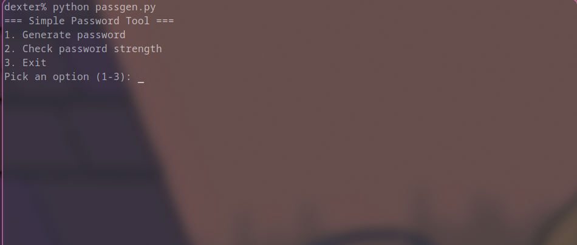
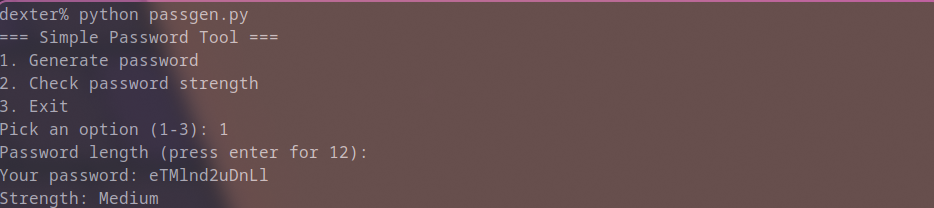
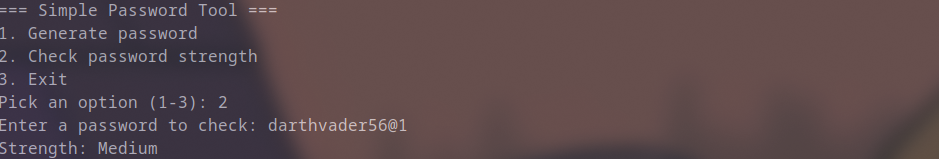

PASSGEN: SECURE PASSWORD GENERATOR & STRENGTH ANALYZER
=====================================================

OVERVIEW
--------
PassGen is a lightweight, terminal-based security utility built in Python. It creates cryptographically secure passwords and evaluates the complexity of existing credentials.

Many basic password scripts use Python's built-in "random" module, which runs on the Mersenne Twister algorithm. This algorithm is completely deterministic and mathematically unsafe for security purposes. PassGen solves this by using Python's standard "secrets" library, which pulls true hardware-level entropy directly from the operating system (/dev/urandom on Linux). It runs completely within the Python standard library with zero external dependencies.

FEATURES
--------
* Cryptographically Secure Generation: Generates credentials via secrets.choice to prevent pattern guessing and reconstruction attacks.
* Customizable Length: Supports custom string lengths while combining lowercase, uppercase, numerical, and special characters.
* Multi-Vector Strength Checking: Scores passwords against four criteria (minimum length of 10, uppercase letters, digits, and special characters) and classifies them as Weak, Medium, or Strong.
* Zero Dependencies: Runs out of the box using only Python 3 core libraries—no pip installations or virtual environments required.
* Terminal Interface: Direct interactive CLI with options to generate passwords, test strings, or exit.

SCOPE & REQUIREMENTS
--------------------
1. Functional Requirements:
   - Module 1 (Generation): Generates cryptographically random passwords with user-defined length.
   - Module 2 (Strength Analysis): Evaluates input strings against length, case, numeric, and symbol rules.
   - Module 3 (CLI Interaction): Provides an interactive terminal menu with input validation and clean exit handling.

2. Non-Functional Requirements:
   - Security: Utilizes OS-level CSPRNG entropy rather than predictable PRNG algorithms.
   - Performance: Instantaneous generation and validation (<5 ms) with minimal memory footprint.
   - Reliability & Portability: Runs out of the box on Python 3.8+ across all operating systems.
   - Usability: Clear prompts, fallback defaults, and friendly error handling.

TECHNOLOGIES & TOOLS USED
-------------------------
* Language: Python 3
* Built-in Modules:
  - secrets: Cryptographically secure pseudo-random number generator (CSPRNG).
  - string: Predefined character pools (ascii_lowercase, ascii_uppercase, digits).
  - sys: System-level clean exit handling.
* Testing: unittest (automated validation suite)
* Version Control: Git & GitHub

PROJECT STRUCTURE
-----------------
PassGen/
├── assets/             Terminal execution screenshots
├── passgen.py          Core application script (generation, checking, CLI)
├── testpassgen.py      Automated unit tests for validation
├── statement.md        Problem statement, scope, target users, and features
├── .gitignore          Excludes Python cache files (__pycache__)
└── README.md           Project overview, setup instructions, and documentation

STEPS TO INSTALL & RUN THE PROJECT
----------------------------------
1. Clone the repository:
   git clone https://github.com/Ansh236/PassGen.git
   cd PassGen

2. Verify Python 3 installation:
   python --version

3. Run the application:
   python passgen.py

4. Using the tool:
   - Enter 1 to generate a password (press Enter for the default length of 12, or type a custom length).
   - Enter 2 to input and check an existing password.
   - Enter 3 to exit.

INSTRUCTIONS FOR TESTING
------------------------
An automated test suite is provided to verify generation length and strength rating logic:

1. Run the test runner:
   python testpassgen.py

2. Expected output:
   ...
   ----------------------------------------------------------------------
   Ran 3 tests in 0.000s

   OK

SCREENSHOTS
-----------
1. Application Launch & Main Menu:

2. Password Generation:

3. Password Strength Checker:
